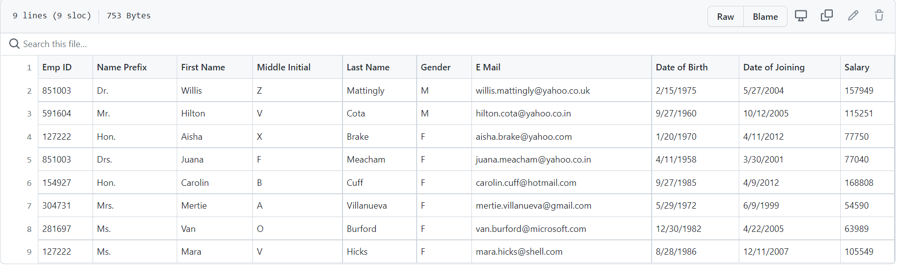
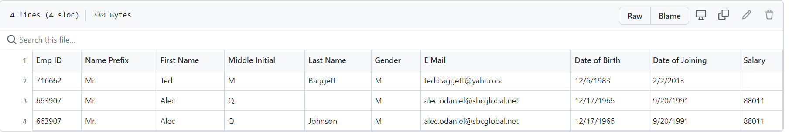
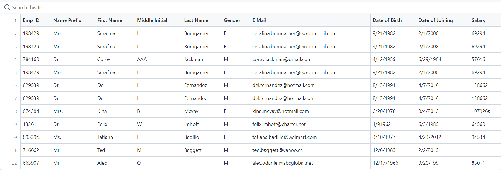
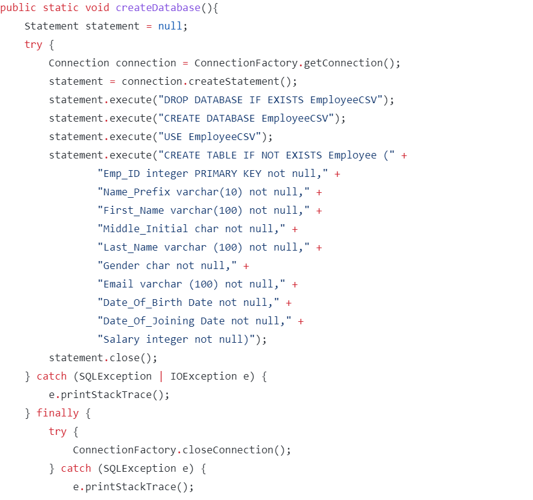
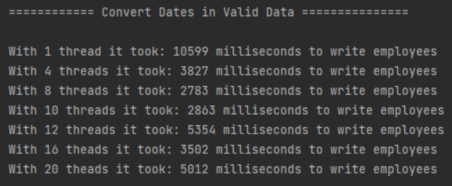
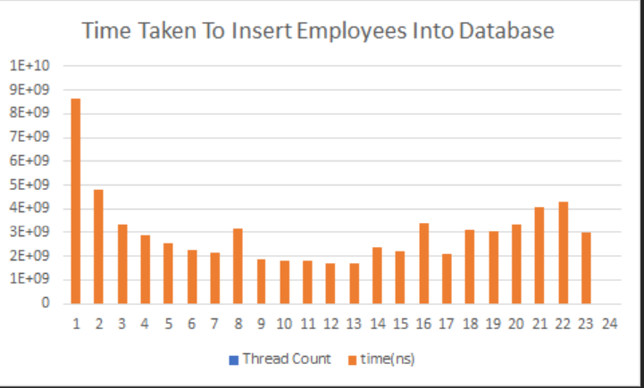

# Employee CSV Date Migration Project

#### Developed by Aiden Sykes, Antony Ademefun, Monali Dhamale and Piotr Sulek


### Table Of Contents

<!-- TABLE OF CONTENTS -->
<details>
  <summary>Table of Contents</summary>
  <ol>
    <li>
      <a href="#about-the-project">About The Project</a>
      <ul>
        <li><a href="#built-with">Built With</a></li>
      </ul>
    </li>
    <li>
      <a href="#getting-started">Getting Started</a>
      <ul>
        <li><a href="#prerequisites">Prerequisites</a></li>
        <li><a href="#installation">Installation</a></li>
      </ul>
    </li>
    <li><a href="#tour">Project Tour</a></li>
    <li><a href="#development">Development</a></li>
    <li><a href="#contact">Contact</a></li>
    <li><a href="#acknowledgments">Acknowledgments</a></li>
  </ol>
</details>

### About the Project

This project has been developed as a team of four during the span of a week. We split our workload and co-ordinated our meetings by the use of agile methodology.


The project's functionality includes being able to read, validate and write CSV Files to databases.


<p align="right">(<a href="#top">back to top</a>)</p>

### Built With

* [IntelliJ Community and Ultimate Edition](https://www.jetbrains.com/idea/)
* [GitHub Desktop](https://desktop.github.com)
* [junit-jupiter:5.8.2](https://junit.org/junit5/docs/current/user-guide/)
* MySQL

### Dependencies

* junit.jupiter Version 5.8.2
* apache.logging.log4j Version 2.17.1


<p align="right">(<a href="#top">back to top</a>)</p>


## Getting Started

Simply run this project using IntelliJ Community Edition. Make sure to install the dependencies and implementations listead above.

### Installation

1. Clone the repository below.
   ```sh
   git clone https://github.com/piotr02/Employee-CSV-Data-Migration-Project.git
   ```
2. Either import or run the downloaded file onto IntelliJ.


<p align="right">(<a href="#top">back to top</a>)</p>


### Project Tour

#### Phase 1 : Created Employee-CSV-Data-Migration-Project and wrote code to read data from a CSV file. Corrupt or duplicated data and records with missing fields,              added to a separate collection for analysis i.e TestCorruptedData.csv,TestDuplicatedData.csv files and TestMissingValuesData.csv file and testes the files with the            help JUnit.
* Duplicate Data
             
* Missing Values
             
* Corrupt Data
              
             
#### Phase 2 : Used MySQL Database and created a connection and transferred dates from JAVA to SQL. 
* Created database  from JAVA to Mysql


#### Phase 3 : Implemented multiple threads to write the data and compared the execution time. 

* Comparison of the execution time
  
  
#### Phase 4 : Modified code to make use of functional programming concepts – lambdas and streams.

### JUnit Testing

JUnit testing allows us to test the model methods of the project without having to participate in lengthy manual testing.

Effecient use of JUnit Tests will allow us to maintain our program to ensure that it works without any error.

We can find errors by asserting  results and comparing it to the actual result.

Looking at our test coverage, the average % of code coverage is being dragged down by code unsuitable for unit testing. The classes which see most use within the main method of our project have exceedingly high coverage

### Manual Testing

The parts of the program which were not suitable for unit testing were
tested manually multiple times. E.g. user input was tested by entering wrong
values and then trying to make it impossible for the user to break the code by doing so.

The console interface was also heavily tested by trying to input all
possible combinations and incorrect values. Every part of the interface was
tested to check whether the design stayed consistent. This part required
many adjustments as the interface used many classes and methods written by
more than one person.

### Future Developments

Outside the time given for this project, we would like to implement a more user-friendly design. This shall allow users to select what outputs they desire such as the amount of corrupted data rather than getting all data.


## Technologies:

Project is created with:
* IntelliJ IDEA 2021.3.1
* junit-jupiter:5.8.2
* apache.logging.log4j:2.17.1
* Java for IntelliJ
* GitHub Desktop
* GitHub
* MySQL

<!-- ACKNOWLEDGMENTS -->
## Acknowledgments

Thank you to the Training Staff at Sparta Global for teaching and assisting us during the development of our project.

* Nishant Mandal
* Paula Kendra
* Neil Weightman

<p align="right">(<a href="#top">back to top</a>)</p>